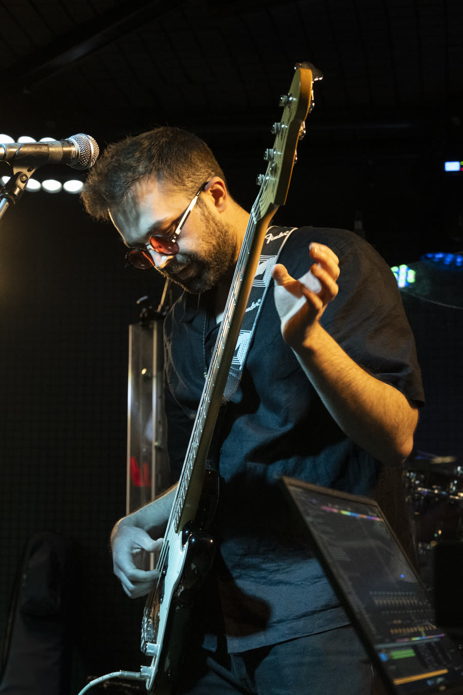
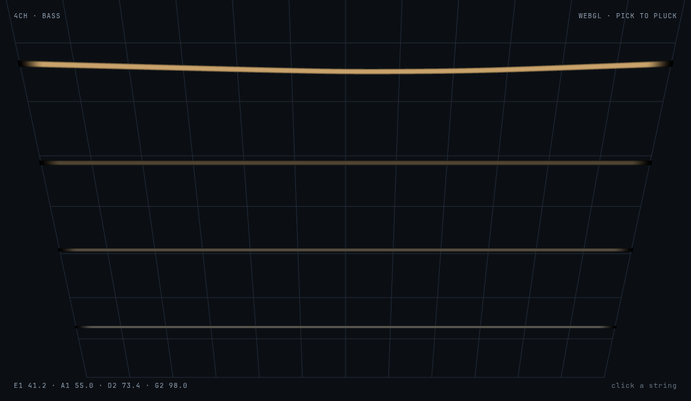

# Demir Topaktaş

Software engineer in Ankara. I spend most of my time on **TypeScript**, **GIS**, **WebGL**, and **3D visualization**, on geospatial software: web maps, 3D views, and the TypeScript that holds them together.

If you are hiring for GIS, visualization, or graphics-adjacent work, I am interested in talking.

## What you will find here

Most of my GIS and TypeScript work sits in professional code, so this profile is small on purpose.

- [webglplayground](https://github.com/demode29/webglplayground) — 3D graphics learning series. I implement the studies myself.

## Four strings

Bass is listening with your hands: time, weight, and the space between notes. A good line is the same kind of problem as a good scene — you only add what the room still needs. I am not interested in playing a lot of notes. I am interested in the ones that hold the picture up.

  

  

